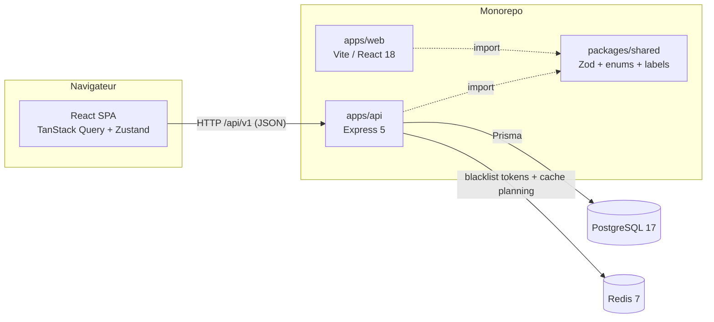
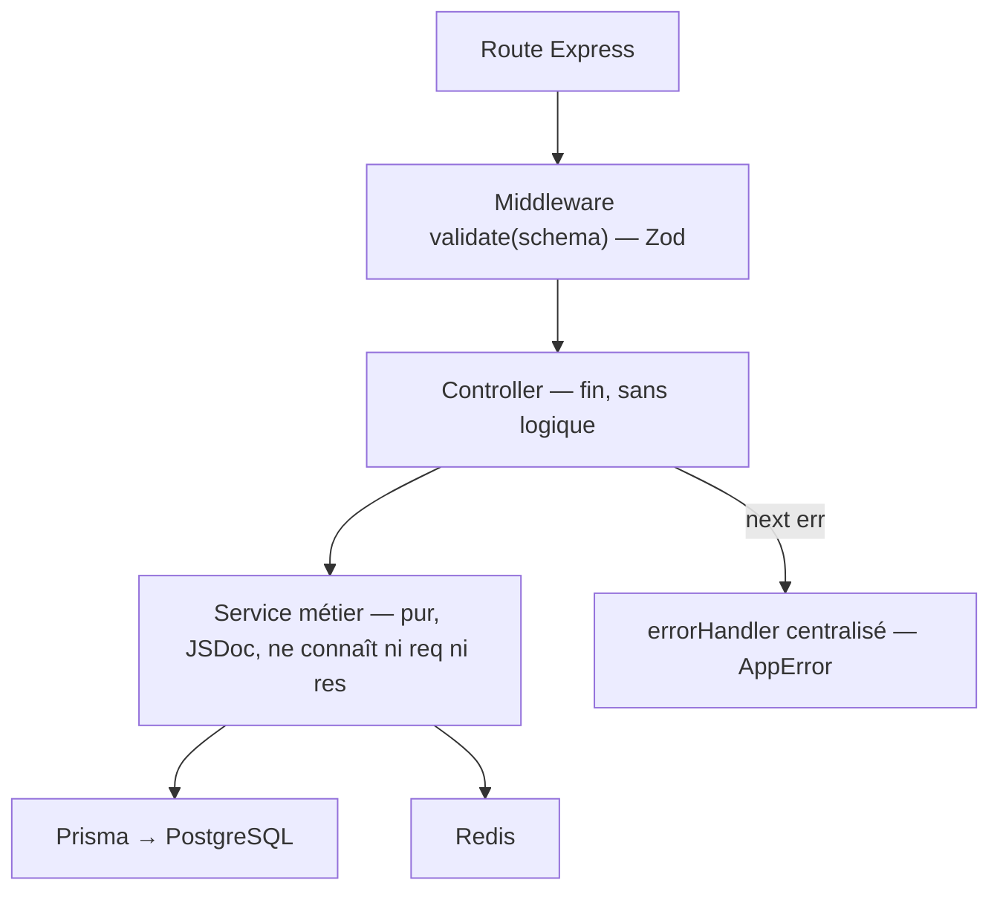
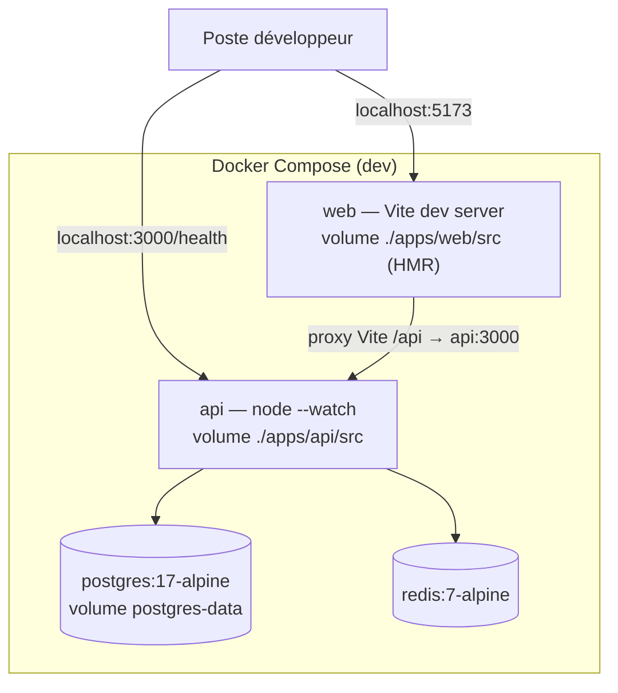
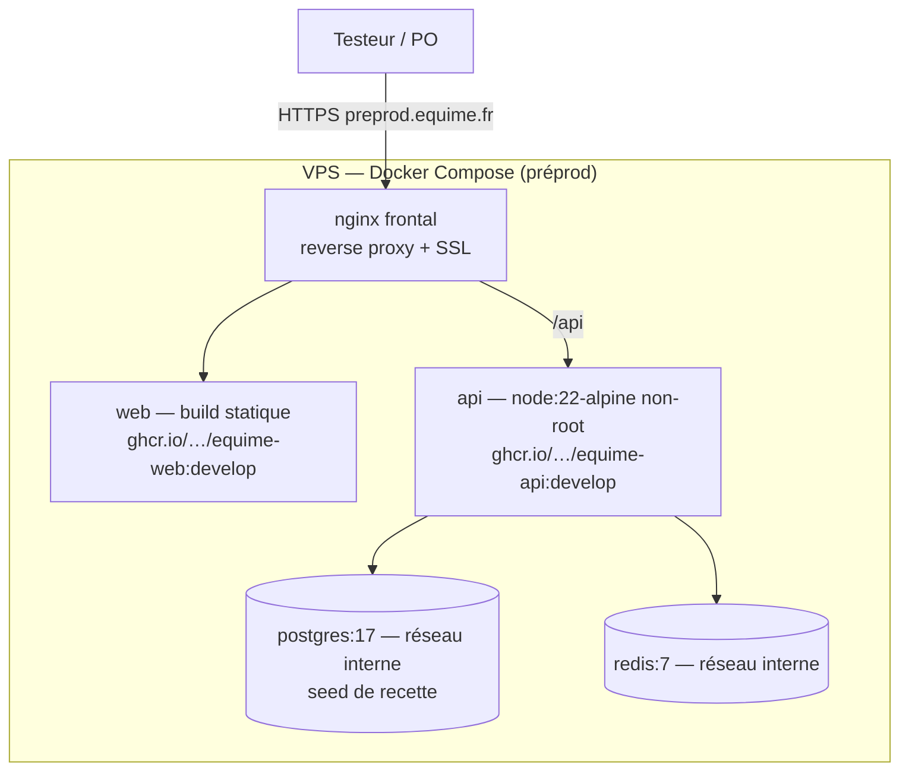
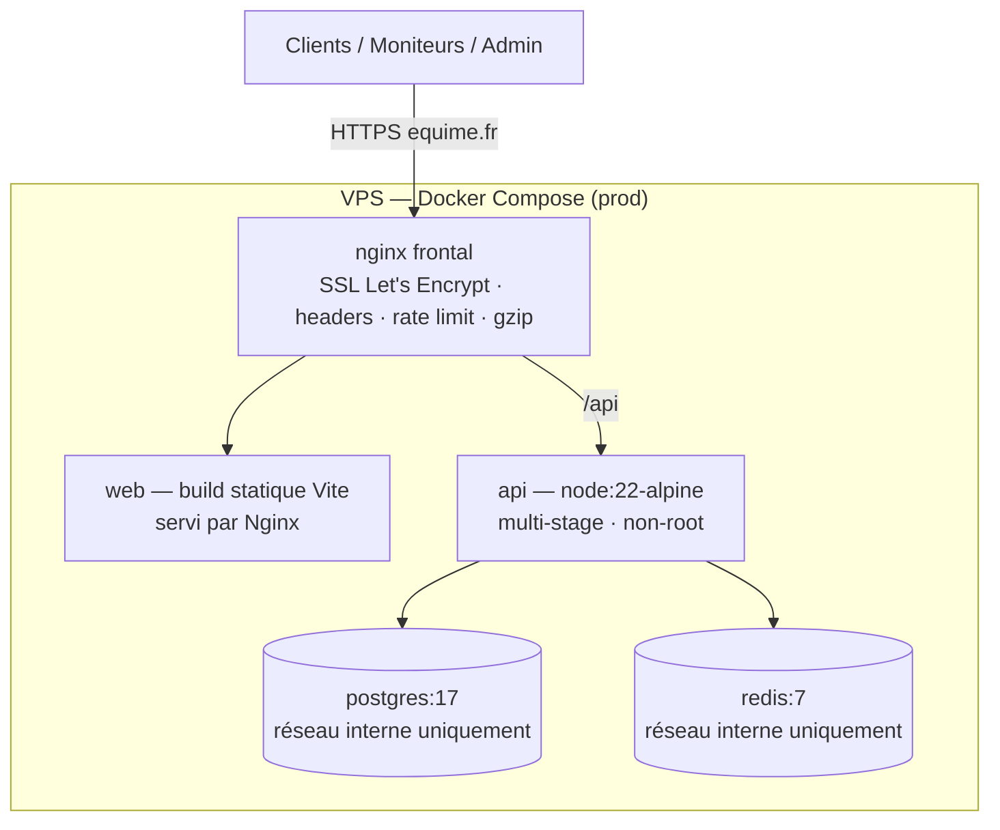
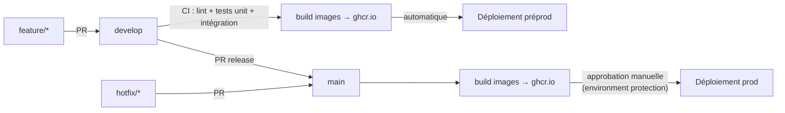

# Architecture — Equime

> Livrable Phase 0. Décrit le monorepo, l'architecture applicative et les trois environnements Docker.
> Les décisions structurantes sont tracées en ADR dans `docs/adr/` (à partir de la Phase 1).

## 1. Vue d'ensemble

Equime est une application web en **monorepo npm workspaces**, 100 % JavaScript (ESM, Node 22) :

| Workspace | Rôle |
|---|---|
| `apps/api` | API REST Express 5 — couches strictes : route → validation Zod → controller → service → Prisma |
| `apps/web` | SPA React 18 (Vite), organisée par features, thème Tailwind 4 dérivé du design system |
| `packages/shared` | Schémas Zod, énumérations et libellés français — source unique de vérité front/back |

### Couches de l'API

## 2. Environnement de développement

`docker-compose.yml` — hot reload, volumes locaux, ports exposés pour le debug.

- Le serveur Vite proxifie `/api` vers le conteneur `api` : pas de CORS inter-domaines en dev, mêmes chemins qu'en prod.
- `node --watch` et le HMR Vite rechargent à chaud le code monté en volume (polling activé pour les volumes Windows).
- Postgres et Redis exposent leurs ports sur l'hôte pour l'outillage local (Prisma Studio, redis-cli).

## 3. Environnement de préproduction (finalisé en Phase 6)

`docker-compose.preprod.yml` — **iso-prod** : mêmes images multi-stage que la production (tirées de ghcr.io, tag `develop`), même Nginx. Base dédiée alimentée par le **seed de recette** (données réalistes anonymisées). Le **cahier de recette** y est exécuté avant chaque mise en production.

## 4. Environnement de production (finalisé en Phase 6)

`docker-compose.prod.yml` — un seul point d'entrée : Nginx frontal (SSL Let's Encrypt, headers de sécurité, rate limit, gzip). Postgres et Redis sur réseau interne, **aucun port exposé**. API en image multi-stage `node:22-alpine`, user non-root.

## 5. Flux CI/CD (GitFlow)

- Branches : `main` (prod), `develop` (préprod), `feature/*`, `hotfix/*`. Commit direct sur `main` interdit.
- Sur chaque PR et push : lint + tests unitaires + tests d'intégration (services Postgres + Redis en CI à partir de la Phase 2).
- Migrations Prisma versionnées (`prisma migrate deploy` au déploiement) — jamais de `db push` hors dev.

## 6. Ports et URLs (dev)

| Service | URL / port |
|---|---|
| Web (Vite) | http://localhost:5173 |
| API | http://localhost:3000 — santé : `GET /health` |
| PostgreSQL | localhost:5432 |
| Redis | localhost:6379 |
