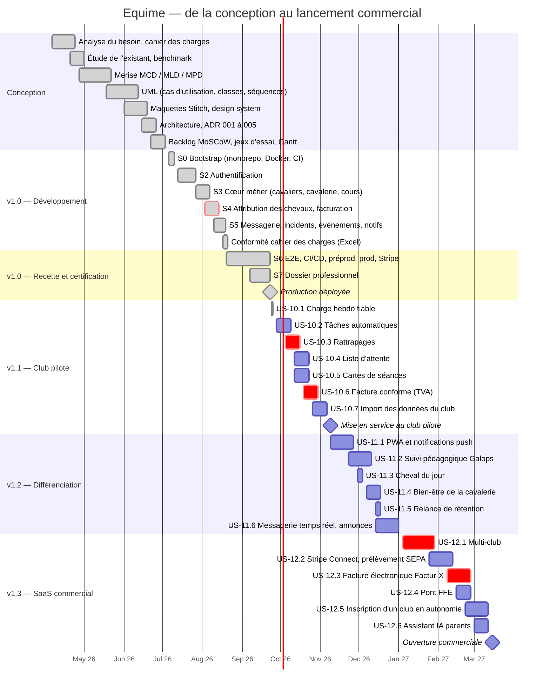
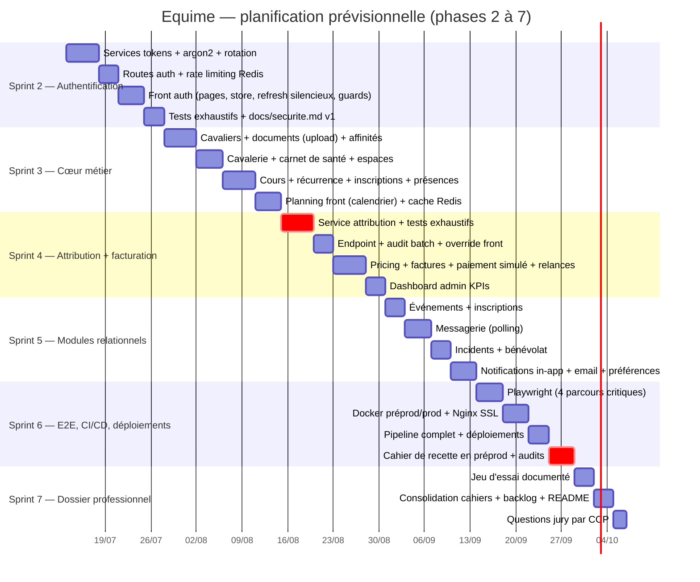

# Gantt — Equime

## Vue d'ensemble : avril 2026 → mars 2027

> Réalisé (conception, développement v1.0, certification) et roadmap post-certification
> (v1.1 à v1.3, voir `docs/backlog.md`, EPIC 10 à 12). Les dates de conception sont
> reconstituées (le dépôt actuel démarre au bootstrap du 6 juillet). Même découpage que le
> projet GitHub **Equime — Roadmap** (vue Roadmap), qui fait référence au quotidien.

**Échéance externe :** émission obligatoire des factures électroniques au 1er septembre 2027
pour les clubs assujettis à la TVA (réception depuis le 1er septembre 2026). US-12.3 doit être
livrée et éprouvée bien avant.

---

## Gantt prévisionnel initial — Phases 2 → 7

> Livrable Phase 1, conservé pour comparer le prévu et le réalisé.
> Planification indicative par sprints hebdomadaires à partir du 13 juillet 2026,
> ajustée en fin de chaque phase (vélocité constatée). Le passage d'une phase à la suivante est
> conditionné au GO explicite après recette de la phase.

## Jalons

| Jalon | Condition de franchissement |
|---|---|
| Fin S2 | Parcours inscription → connexion → refresh → déconnexion démontrable ; tests auth verts |
| Fin S3 | Un client inscrit un cavalier à un cours récurrent visible au planning |
| Fin S4 | Attribution automatique + facture payée de bout en bout ; couverture ≥ 70 % maintenue |
| Fin S5 | Les 8 types de notification partent selon les préférences |
| Fin S6 | Cahier de recette exécuté (CI + smoke préprod/prod), prod déployée avec approbation — **atteint 2026-09-23** |
| Fin S7 | Dossier livrable au jury — **atteint** (traçabilité, soutenance, questions, cahiers alignés) |

## Risques planifiés

| Risque | Impact | Mitigation |
|---|---|---|
| Complexité de la rotation des tokens | Glissement S2 | Séquence UML déjà validée ; tests écrits au fil de l'eau |
| Cas limites de l'attribution | Glissement S4 | Fonction de scoring pure isolée ; jeu d'essai défini dès la Phase 1 |
| Mise au point SSL/déploiement VPS | Glissement S6 | Préprod iso-prod dès le début du sprint ; procédure pas à pas documentée |
