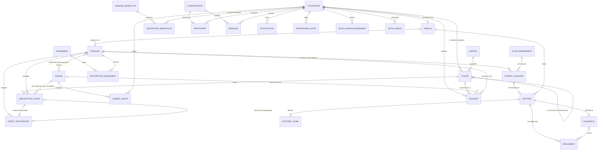

# MCD — Modèle Conceptuel de Données

> Livrable Phase 1 (Merise). Diagramme Mermaid destiné à être retravaillé dans Looping/draw.io.
> Le MCD raisonne en **entités / associations / cardinalités**, sans clés étrangères ni types SQL
> (voir `mld.md` pour la transposition relationnelle et `mpd.md` pour le modèle physique).

## Périmètre

Gestion d'un centre équestre : comptes et familles, cavaliers, cavalerie et affinités,
espaces, cours récurrents et présences, événements, facturation et abonnements,
incidents, bénévolat, messagerie, notifications, authentification (jetons).

## Hypothèses de modélisation validées

| Sujet | Décision |
|---|---|
| Récurrence des cours | Chaque séance est une occurrence de COURS ; la série est portée par la séance « mère » (association réflexive) |
| Messagerie | Conversations multi-participants (groupes supportés), marquage lu par participant (`lastReadAt`) |
| Notifications in-app | Entité NOTIFICATION dédiée (ajout par rapport au modèle v0.1.0) |
| Factures | Détail en entité FACTURE_LIGNE (pas de JSON) |
| Compatibilité de niveau cheval | Plage `niveauMin`–`niveauMax` portée par le CHEVAL |
| Réinitialisation de mot de passe | Entité JETON_REINIT (ajout nécessaire au parcours « mot de passe oublié ») |

## Dictionnaire des entités

| Entité | Description | Attributs principaux |
|---|---|---|
| UTILISATEUR | Compte applicatif (client, moniteur, admin) | email, motDePasseHash, nom, prénom, rôle, banni, anonyméLe |
| FAMILLE | Foyer client (parent titulaire du compte) | — (les forfaits sont portés par les cavaliers, ADR 011) |
| CAVALIER | Pratiquant rattaché à une famille | nom, prénom, dateNaissance, niveau, certificatMédical (statut), licence (statut), consentementMédical |
| CHEVAL | Équidé du centre | nom, race, annéeNaissance, statut, niveauMin, niveauMax, chargeHebdo, chargeMax, seuilAlerte |
| ESPACE | Lieu de pratique | nom, type (manège/carrière/paddock), capacité |
| COURS | Séance de cours (une occurrence = une ligne) | titre, débutLe, finLe, capacité, niveauMin/Max, statut, règleRécurrence, finRécurrence |
| ÉVÉNEMENT | Stage ou compétition | titre, type, débutLe, finLe, capacité, prix |
| PLAN_ABONNEMENT | Forfait proposé par le club | nom, prixSaison, séancesParSemaine, actif |
| FORFAIT_CAVALIER | Forfait de saison d'un cavalier (ADR 011) | débutSaison, finSaison, débutEffectif, échéancier (trimestre/10 fois), prix, réduction %, statut, arrêtéLe |
| CRÉDIT_RATTRAPAGE | Séance à rattraper (annulation à temps ou par le club) | origine, expireLe, utiliséLe |
| ÉCHÉANCE | Échéance d'une facture | rang, dueLe, montant, régléeLe |
| RÈGLEMENT | Paiement reçu (en ligne ou au club) | mode, montant, reçuLe, référence |
| RÈGLE_RÉDUCTION | Règle tarifaire | libellé, pourcentage, minCavaliers, actif |
| FACTURE | Facture émise à une famille | numéro, statut, émiseLe, échéance, totalCentimes, payéeLe |
| FACTURE_LIGNE | Ligne de détail d'une facture | libellé, quantité, prixUnitaire, total |
| CARNET_SANTÉ | Entrée du carnet de santé d'un cheval | type (véto/maréchal/…), notes, surveuLe |
| INCIDENT | Incident déclaré | gravité, description, statut, survenuLe, résoluLe |
| MISSION_BÉNÉVOLAT | Mission proposée aux familles | titre, débutLe, places |
| CONVERSATION | Fil de discussion | sujet |
| MESSAGE | Message d'une conversation | contenu, envoyéLe |
| NOTIFICATION | Notification in-app | type, titre, corps, luLe |
| PRÉFÉRENCE_NOTIF | Préférence par type de notification | type, emailActivé, inAppActivé |
| JETON_RAFRAÎCHISSEMENT | Refresh token (hashé, à rotation) | hash, familleJetons, expireLe, révoquéLe |
| JETON_REINIT | Jeton de réinitialisation de mot de passe | hash, expireLe, utiliséLe |

## Diagramme conceptuel

Lecture des cardinalités : `UTILISATEUR 0,1 — 1,1 FAMILLE` se lit « un utilisateur possède 0 ou 1 famille ;
une famille appartient à exactement 1 utilisateur ».

### Associations porteuses de données

- **AFFINITÉ** (CAVALIER ↔ CHEVAL) : porte l'attribut `affinité` ∈ {favori, neutre, à éviter}. Entrée majeure de l'algorithme d'attribution.
- **INSCRIPTION_COURS** (CAVALIER ↔ COURS) : porte `présence` ∈ {en attente, présent, absent, excusé}, `statut` ∈ {active, annulée} (`annuléeLe`), le `droit` consommé ∈ {séance du forfait, rattrapage, forcée} et le lien facultatif vers le CHEVAL attribué (`attribuéLe`).
- **INSCRIPTION_ÉVÉNEMENT** (CAVALIER ↔ ÉVÉNEMENT) : porte `statut` ∈ {en attente, confirmée, annulée}.
- **PARTICIPANT** (UTILISATEUR ↔ CONVERSATION) : porte `dernierLuLe` (marquage lu par participant).
- **INSCRIPTION_BÉNÉVOLAT** (UTILISATEUR ↔ MISSION_BÉNÉVOLAT) : association simple datée.

### Règles de gestion associées

1. Un utilisateur de rôle `client` possède exactement une famille ; les moniteurs et admins n'en ont pas.
2. Un cavalier ne peut être inscrit qu'une fois à une même séance ; un cheval ne peut être attribué qu'à un cavalier par séance.
3. Seuls les chevaux `en forme` dont la charge de la semaine de la séance (calculée à partir des affectations, ADR 010) est inférieure au maximum sont éligibles à l’attribution.
4. Une facture annulée ou payée n'est jamais supprimée (RGPD : anonymisation du compte, conservation des données de facturation).
5. La révocation d'un jeton de rafraîchissement réutilisé entraîne la révocation de toute sa famille de jetons.
6. Un cavalier a au plus un forfait actif par saison ; il donne droit à `séancesParSemaine` séances par semaine ISO (heure de Paris), puis aux rattrapages disponibles (ADR 011).
7. Une annulation dans le délai du club produit au plus un crédit ; une inscription annulée n'occupe plus de place ni de charge cheval.
8. Les règlements couvrent les échéances dans l'ordre ; une facture est payée quand ils couvrent son total.
