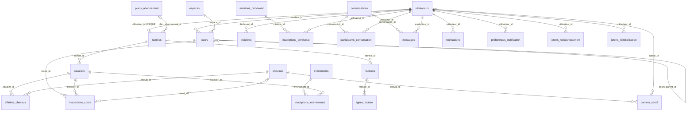

# MLD — Modèle Logique de Données

> Livrable Phase 1 (Merise). Transposition relationnelle du MCD (`mcd.md`) :
> les associations n-n deviennent des relations, les cardinalités deviennent des clés étrangères.
> Notation : **clé primaire soulignée** = `#`, clé étrangère = `→ table(clé)`.

## Règles de passage appliquées

1. Chaque entité devient une relation avec une clé primaire technique `id` (identifiant opaque, généré par l'application).
2. Association 1-n → clé étrangère côté « n » (ex. CAVALIER porte `famille_id`).
3. Association 0,1-1 → clé étrangère **unique** côté porteur (FAMILLE porte `utilisateur_id` UNIQUE).
4. Association n-n → relation dédiée portant les deux clés étrangères + attributs de l'association, avec contrainte d'unicité sur le couple (ex. AFFINITÉ(cavalier_id, cheval_id) UNIQUE).
5. Association réflexive de récurrence → clé étrangère `cours_parent_id` sur COURS (nullable).
6. Toutes les relations portent `créé_le` et `modifié_le` (traçabilité).

## Relations

```
utilisateurs(#id, email UNIQUE, mot_de_passe_hash, prénom, nom, téléphone?, rôle, banni, banni_le?, anonymisé_le?)

familles(#id, utilisateur_id UNIQUE → utilisateurs(id), plan_abonnement_id? → plans_abonnement(id), quota_séances)

cavaliers(#id, famille_id → familles(id), prénom, nom, date_naissance, niveau,
          certificat_médical_url?, certificat_médical_statut, licence_url?, licence_statut, consentement_médical_le?)

chevaux(#id, nom, race?, année_naissance?, photo_url?, statut, niveau_min, niveau_max,
        charge_hebdo_heures, charge_hebdo_max, seuil_alerte_heures)

affinités_chevaux(#id, cavalier_id → cavaliers(id), cheval_id → chevaux(id), affinité,
                  UNIQUE(cavalier_id, cheval_id))

espaces(#id, nom UNIQUE, type, capacité?)

carnets_santé(#id, cheval_id → chevaux(id), auteur_id? → utilisateurs(id), type, notes, survenu_le)

cours(#id, titre, description?, moniteur_id → utilisateurs(id), espace_id → espaces(id),
      début_le, fin_le, capacité, niveau_min, niveau_max, statut,
      règle_récurrence?, fin_récurrence?, cours_parent_id? → cours(id))

inscriptions_cours(#id, cours_id → cours(id), cavalier_id → cavaliers(id), cheval_id? → chevaux(id),
                   présence, cheval_attribué_le?, UNIQUE(cours_id, cavalier_id))

événements(#id, titre, description?, type, début_le, fin_le, capacité, prix_centimes, lieu?)

inscriptions_événements(#id, événement_id → événements(id), cavalier_id → cavaliers(id), statut,
                        UNIQUE(événement_id, cavalier_id))

plans_abonnement(#id, nom UNIQUE, description?, prix_centimes, séances_par_semaine, actif)

règles_réduction(#id, libellé, description?, pourcentage, min_cavaliers?, actif)

factures(#id, famille_id → familles(id), numéro UNIQUE, statut, émise_le?, échéance_le?,
         total_centimes, payée_le?)

lignes_facture(#id, facture_id → factures(id), libellé, quantité, prix_unitaire_centimes, total_centimes)

incidents(#id, déclarant_id → utilisateurs(id), cours_id? → cours(id), cheval_id? → chevaux(id),
          cavalier_id? → cavaliers(id), gravité, description, statut, survenu_le, résolu_le?)

missions_bénévolat(#id, titre, description?, début_le, fin_le?, places)

inscriptions_bénévolat(#id, mission_id → missions_bénévolat(id), utilisateur_id → utilisateurs(id),
                       UNIQUE(mission_id, utilisateur_id))

conversations(#id, sujet?)

participants_conversation(#id, conversation_id → conversations(id), utilisateur_id → utilisateurs(id),
                          dernier_lu_le?, UNIQUE(conversation_id, utilisateur_id))

messages(#id, conversation_id → conversations(id), expéditeur_id → utilisateurs(id), contenu, envoyé_le)

notifications(#id, utilisateur_id → utilisateurs(id), type, titre, corps?, lien_url?, lu_le?)

préférences_notification(#id, utilisateur_id → utilisateurs(id), type, email_activé, in_app_activé,
                         UNIQUE(utilisateur_id, type))

inscriptions_newsletter(#id, email UNIQUE, consenti_le)

jetons_rafraîchissement(#id, utilisateur_id → utilisateurs(id), jeton_hash UNIQUE, famille_id,
                        expire_le, révoqué_le?, user_agent?, ip?)

jetons_réinitialisation(#id, utilisateur_id → utilisateurs(id), jeton_hash UNIQUE, expire_le, utilisé_le?)
```

## Diagramme logique


