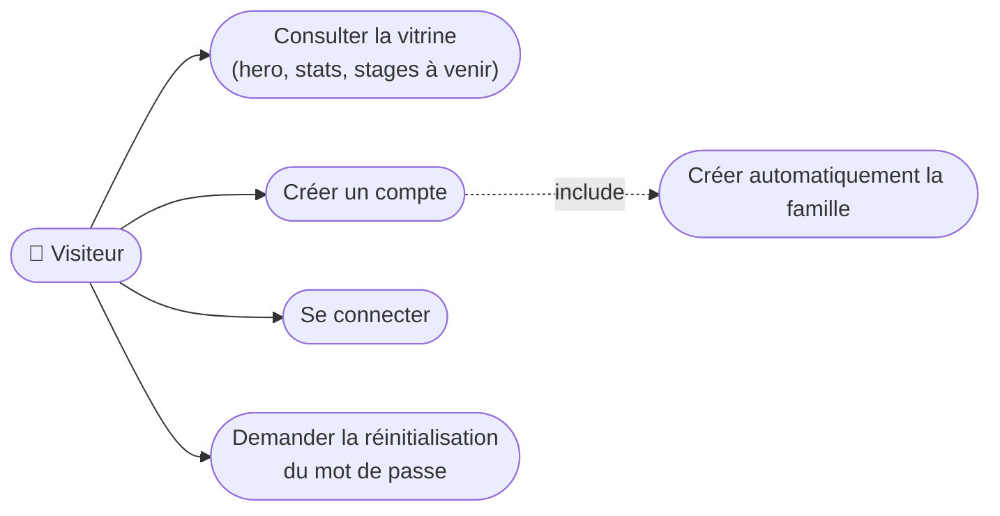
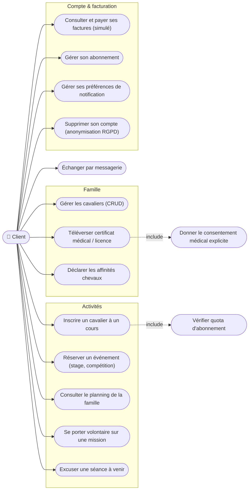
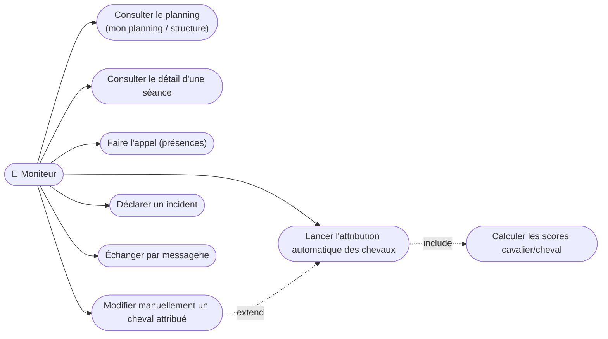
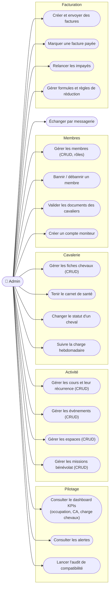

# UML — Diagrammes de cas d'utilisation

> Livrable Phase 1. Un diagramme par rôle (`visitor`, `client`, `instructor`, `admin`).
> Mermaid ne proposant pas de diagramme de cas d'utilisation natif, la convention retenue est :
> acteur = nœud arrondi, cas d'utilisation = ellipse (parenthèses), `<<include>>` = flèche pointillée.

## Visiteur (non connecté)

## Client (famille / cavalier)

## Moniteur

## Admin (secrétariat / direction)

## Matrice rôles ↔ modules (synthèse)

| Module | Visiteur | Client | Moniteur | Admin |
|---|:---:|:---:|:---:|:---:|
| Vitrine / événements publics | ✅ lecture | ✅ | ✅ | ✅ |
| Authentification | ✅ | ✅ | ✅ | ✅ |
| Famille & cavaliers | — | ✅ (sa famille) | — | ✅ (toutes) |
| Planning & inscriptions cours | — | ✅ (sa famille) | ✅ (présences, chevaux) | ✅ (CRUD) |
| Attribution des chevaux | — | — | ✅ (lancer, override) | ✅ (audit batch) |
| Cavalerie & carnet de santé | — | affinités seulement | consultation | ✅ (CRUD) |
| Événements | lecture publique | ✅ (réserver) | consultation | ✅ (CRUD) |
| Facturation & abonnements | — | ✅ (consulter, payer) | — | ✅ (CRUD, relances) |
| Incidents | — | — | ✅ (déclarer) | ✅ (traiter) |
| Bénévolat | — | ✅ (s'inscrire) | — | ✅ (CRUD) |
| Messagerie | — | ✅ | ✅ | ✅ |
| Notifications & préférences | — | ✅ | ✅ | ✅ |
| Administration (membres, KPIs) | — | — | — | ✅ |
