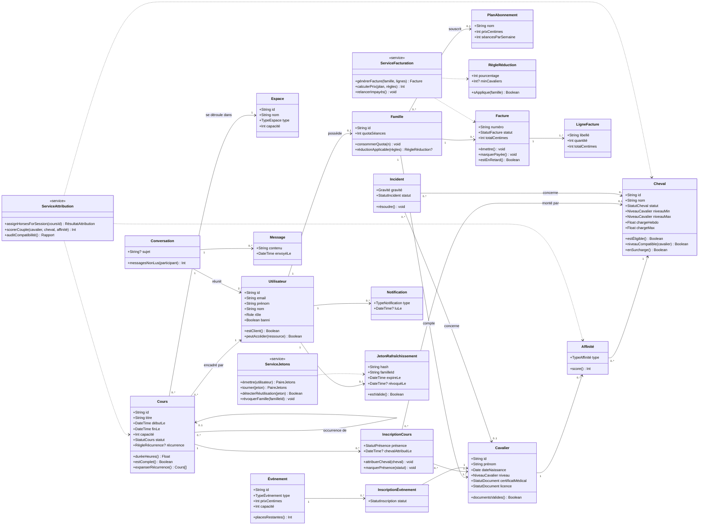

# UML — Diagramme de classes du domaine

> Livrable Phase 1. Vue objet du domaine métier (indépendante de la persistance —
> voir `docs/merise/` pour les modèles de données). Les méthodes listées correspondent
> aux services métier prévus (`apps/api/src/services/`).

## Notes de conception

- Les **services** (stéréotype `<<service>>`) portent la logique transverse à plusieurs entités ;
  ils sont implémentés en fonctions pures + orchestration transactionnelle (`prisma.$transaction`),
  sans dépendance à Express (`req`/`res` interdits dans la couche service).
- `ServiceAttribution.scorerCouple` est une **fonction pure** : entrées (cavalier, cheval, affinité,
  charge) → score entier, testable unitairement sans base de données.
- Les énumérations (`Role`, `NiveauCavalier`, `StatutCheval`…) sont définies une seule fois dans
  `packages/shared/src/constants.js` et réutilisées par le front, l'API et le schéma Prisma.
