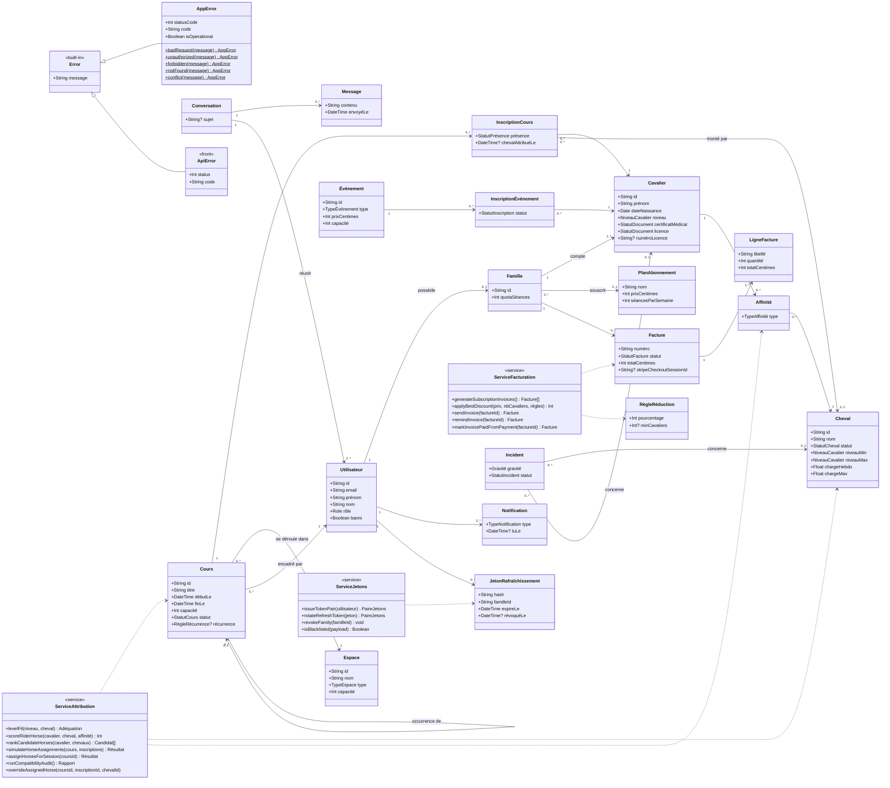

# UML — Diagramme de classes du domaine

> Livrable Phase 1, **aligné sur le code livré** (Phase 7). Vue objet du domaine métier
> (indépendante de la persistance — voir `docs/merise/` pour les modèles de données).
> Les entités ne portent que des **données** ; les comportements sont portés par les
> **services** (`<<service>>`), avec les noms réels des fonctions de `apps/api/src/services/`.
> Ce choix est expliqué en fin de document.

## Notes de conception

### Un domaine « anémique », choisi et assumé

Les entités sont de simples structures de données (objets renvoyés par Prisma) ; toute
la logique vit dans des **services**. Martin Fowler appelle ce style un *modèle de
domaine anémique*, par opposition à un *modèle riche* où chaque entité porte ses règles
(`cheval.estÉligible()`). C'est un choix délibéré :

- les objets manipulés sont ceux de Prisma : les enrichir de méthodes imposerait une
  couche de conversion à chaque lecture ;
- l'architecture en couches d'Express (route → validation → contrôleur → service) place
  naturellement les règles dans les services ;
- les règles clés sont des **fonctions pures** (`scoreRiderHorse`, `levelFit`,
  `applyBestDiscount`, `expandWeeklyRecurrence`), testables sans base de données.

Où se trouvent les comportements qu'un modèle riche aurait portés :

| Responsabilité (modèle riche) | Fonction réelle |
|---|---|
| `Cheval.estÉligible()`, `niveauCompatible()` | `horseAssignment.isEligibleHorse`, `levelFit` (ADR 009) |
| `Cavalier.documentsValides()` | `lib/riderDocuments.assertRiderDocumentsApproved` |
| `Cours.duréeHeures()`, `expanserRécurrence()` | `durationHoursFromRange`, `recurrence.expandWeeklyRecurrence` |
| `Famille.réductionApplicable()` | `pricing.applyBestDiscount` |
| `Facture.émettre()`, `marquerPayée()` | `billingService.sendInvoice`, `markInvoicePaidFromPayment` |
| `JetonRafraîchissement.estValide()` | `tokenService.rotateRefreshToken` |
| `Utilisateur.peutAccéder()` | middlewares `requireAuth` / `requireRole` |

### Ce qui relève réellement de l'objet

- **Héritage** : `AppError extends Error` (API) et `ApiError extends Error` (front).
- **Méthodes de fabrique statiques** : `AppError.notFound()`, `AppError.conflict()`… Un seul
  constructeur, des fabriques qui nomment l'intention et fixent le code HTTP.
- **Polymorphisme** : le gestionnaire d'erreurs traite toute `AppError` de la même façon
  (code et message maîtrisés) et toute autre erreur comme un bug (500 générique).
- **Encapsulation par module** : chaque module n'exporte que son interface publique ; les
  détails (`isEligibleHorse`, `rotateRefreshTokenUnlocked`, la garde `inflightRotations`)
  restent privés au module.
- **Responsabilité unique** : une couche, un rôle ; aucun service ne connaît `req`/`res`.

### Autres points

- Les services (`<<service>>`) sont sans dépendance à Express et orchestrent les écritures
  dans `prisma.$transaction` quand plusieurs tables changent ensemble.
- Les énumérations (`Role`, `NiveauCavalier`, `StatutCheval`…) sont définies une seule fois
  dans `packages/shared/src/constants.js` et réutilisées par le front, l'API et Prisma.
