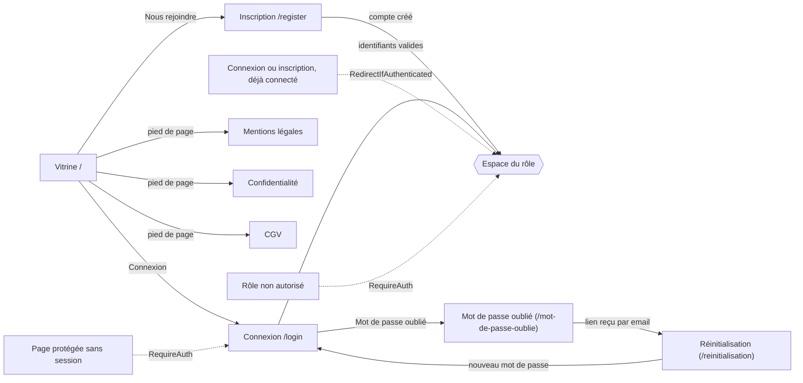
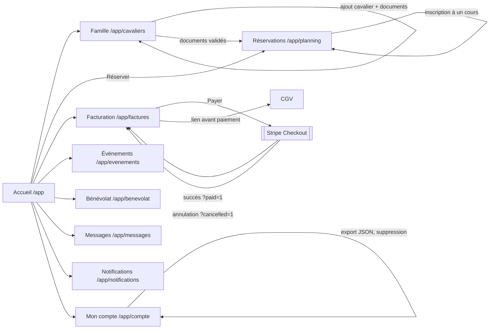
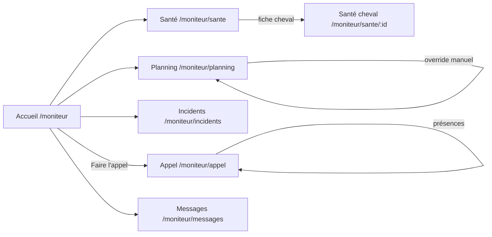
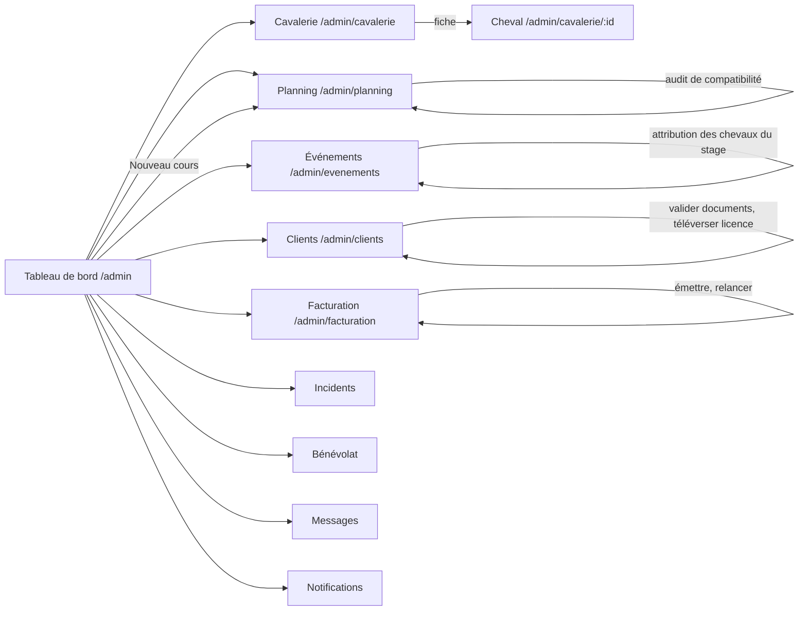

# Schéma de navigation — enchaînement des écrans

> Répond au critère CDA C5 « L'enchaînement des maquettes est formalisé par un schéma »
> (RE TP-01281 v04). Format : **schéma de navigation d'interface** (SNI), un écran par
> nœud et une transition par flèche. Source de vérité : `apps/web/src/router.jsx`
> (routes), `apps/web/src/features/auth/guards.jsx` (redirections) et les layouts par
> rôle (`components/layouts/*Layout.jsx`, barre latérale). Les écrans correspondent aux
> maquettes Stitch (`docs/design-system.md`, ADR 006).

## Légende

- Flèche pleine : action de l'utilisateur (lien, bouton, envoi de formulaire).
- Flèche pointillée : **redirection automatique** par une garde de route.
- Double cadre : service externe.
- Chaque espace connecté a une **barre latérale** : tous ses écrans sont accessibles
  entre eux en un clic (non répété sur les schémas).

## 1. Visiteur et authentification

`APP` renvoie vers `/app` (client), `/moniteur` (moniteur) ou `/admin` (administrateur)
(`HOME_BY_ROLE`). Après connexion, l'utilisateur retrouve la page demandée à l'origine
(`state.from`).

## 2. Client (famille)

**Parcours critique** (scénario E2E-2) : Famille → ajout d'un cavalier → documents validés
par l'admin → Réservations → inscription. Sans cavalier, Réservations affiche un état
vide qui renvoie vers Famille.

## 3. Moniteur

## 4. Administrateur

