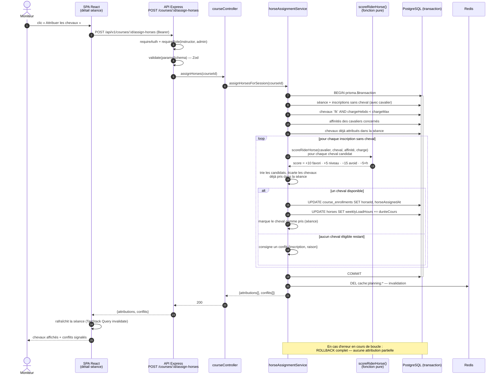
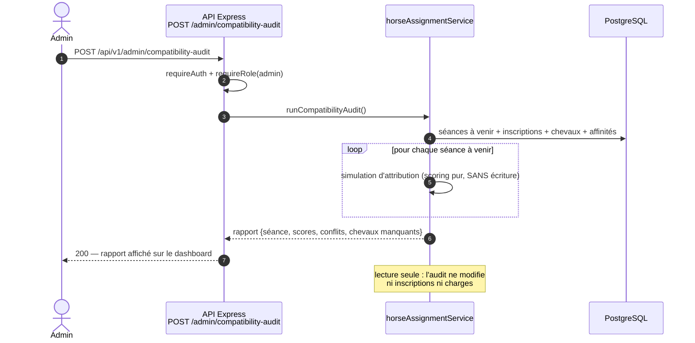

# UML — Diagramme de séquence : attribution automatique des chevaux

> Livrable Phase 1. Pièce maîtresse métier, implémentée en Phase 4 :
> `assignHorsesForSession(courseId)` dans `apps/api/src/services/horseAssignment.js`.
> Architecture : **fonction de scoring pure** (testable sans base) + **orchestration transactionnelle**.

## Règles métier

| Règle | Valeur |
|---|---|
| Chevaux éligibles | statut `fit` **ET** charge hebdomadaire < maximum |
| Score : affinité `favorite` | **+10** |
| Score : niveau cavalier dans la plage du cheval | **+5** |
| Score : affinité `avoid` | **−15** |
| Score : charge hebdomadaire | **−5 × heures** déjà travaillées |
| Attribution | meilleur cheval disponible, non déjà pris dans la séance |
| Effet | `weeklyLoadHours` incrémenté de la durée du cours |
| Atomicité | tout ou rien — `prisma.$transaction` |

## Séquence

## Audit de compatibilité (batch admin)

## Découpage testable (Phase 4)

| Unité | Type de test | Cas couverts |
|---|---|---|
| `scoreRiderHorse()` | unitaire pur | nominal, favori, avoid, niveau hors plage, cumul charge |
| `assignHorsesForSession()` | unitaire (Prisma mocké) + intégration | cas nominal, cheval surchargé, aucun cheval éligible, égalité de scores (départage déterministe), cheval déjà pris dans la séance, rollback sur erreur |
| `runCompatibilityAudit()` | intégration | rapport complet, absence d'écriture en base |
