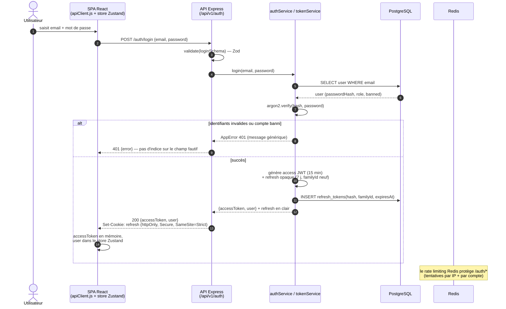
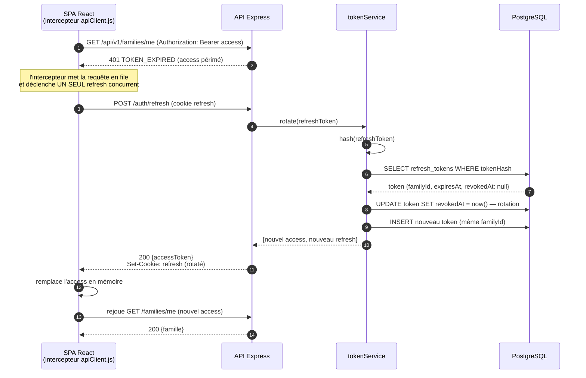
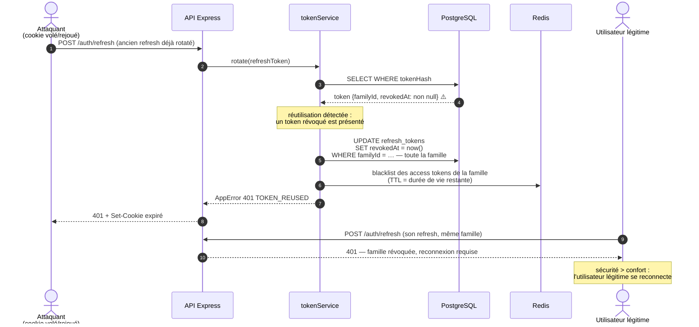
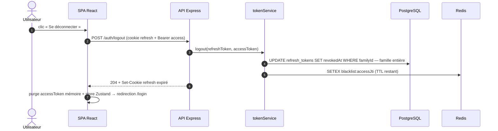

# UML — Diagramme de séquence : authentification complète

> Livrable Phase 1. Couvre le cycle de vie complet des jetons : connexion, rafraîchissement
> silencieux avec **rotation**, et **détection de réutilisation** (révocation de la famille).
> Implémentation en Phase 2 (`apps/api/src/services/` + `apps/web/src/lib/apiClient.js`).

## Principes

- **Access token** : JWT signé, durée 15 min, conservé **en mémoire** côté front (jamais en localStorage).
- **Refresh token** : opaque (aléatoire cryptographique), durée 7 jours, transporté par **cookie httpOnly + Secure + SameSite=Strict**, persisté **hashé** en base (table `refresh_tokens`).
- **Rotation** : chaque usage d'un refresh token le révoque et en émet un nouveau, membre de la même **famille** (`familyId`).
- **Détection de réutilisation** : si un token déjà révoqué est présenté (vol de cookie, rejeu), toute la famille est révoquée → déconnexion de toutes les sessions issues de cette lignée.

## 1. Connexion

## 2. Rafraîchissement silencieux avec rotation

## 3. Détection de réutilisation → révocation de la famille

## 4. Déconnexion

